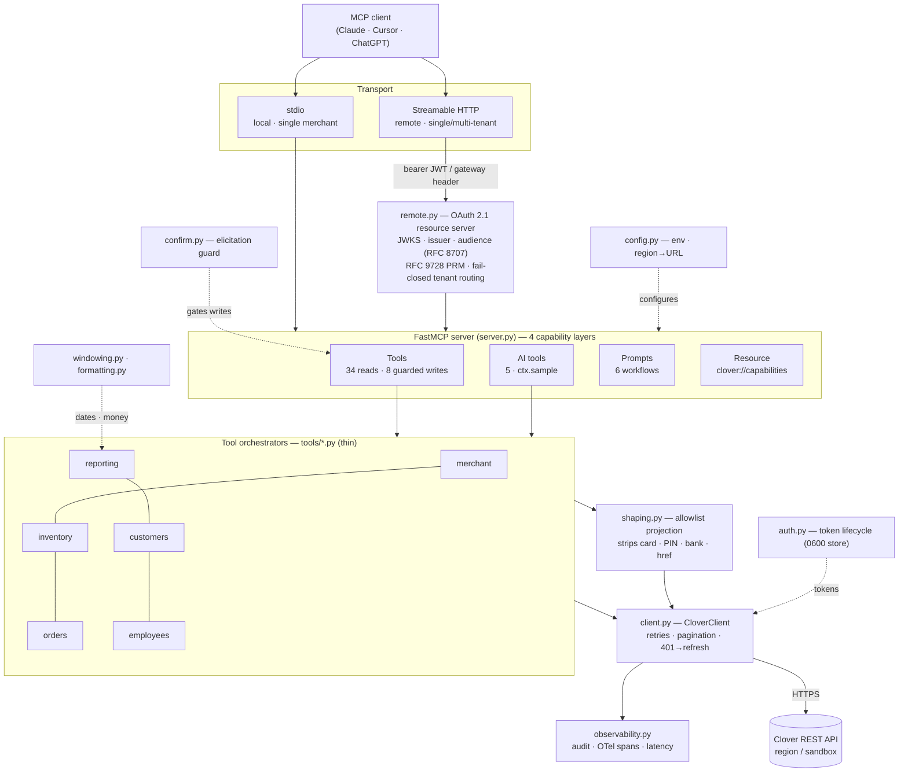
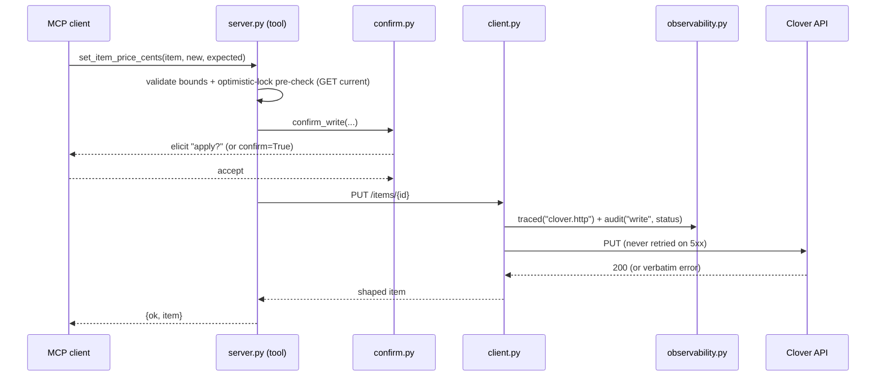

# Architecture

clover-mcp is a FastMCP server with strict separation of concerns: each module
does one job (see [CLAUDE.md](../CLAUDE.md)). Tools are thin orchestrators —
**validate → call the client → shape the response** — and everything sensitive is
removed by an allowlist before it leaves the process.

## System diagram

## Request flow (a guarded write)

## Modules (one job each)

| Module | Concern | Must not |
|---|---|---|
| `config.py` | env, validation, region→URL | make HTTP calls |
| `auth.py` | token lifecycle, refresh, 0600 store | business logic |
| `remote.py` | OAuth resource server, multi-tenant routing | know about resources |
| `client.py` | HTTP transport, retries, pagination | know Clover resources |
| `shaping.py` | allowlist projection, PII removal | know tools or auth |
| `windowing.py` | date chunking, ms conversion | know HTTP |
| `formatting.py` | money & time display | know the API |
| `observability.py` | audit, OTel spans, latency | swallow errors |
| `confirm.py` | write confirmation (elicitation) | perform I/O |
| `tools/*.py` | orchestrate one user action | duplicate HTTP/shaping |
| `server.py` | register tools/prompts/resources, run | business logic |

## Key design choices

- **Allowlist, not denylist.** Shapers keep only named fields, so a new sensitive
  Clover field can't leak by default — enforced by a contract test and re-checked
  on live data by the [eval](eval.md).
- **Writes are a privilege.** Every write has an explicit id, an expected-current
  pre-check (optimistic lock), input bounds, `dry_run`, and confirmation; writes
  are never retried on 5xx (non-idempotent). No payment capture / refund / delete.
- **Auth at the edge, tenant from the token.** In multi-tenant mode the merchant
  is derived from the validated identity, never a client-supplied value; header
  routing is fail-closed until verified (see [SECURITY.md](SECURITY.md)).
- **Observability is opt-in and free when off.** OTel spans only when an exporter
  is configured; audit/latency are structured stderr lines.
